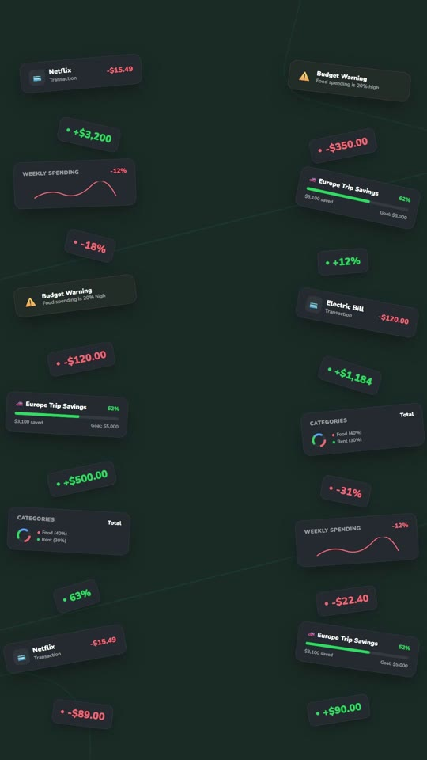
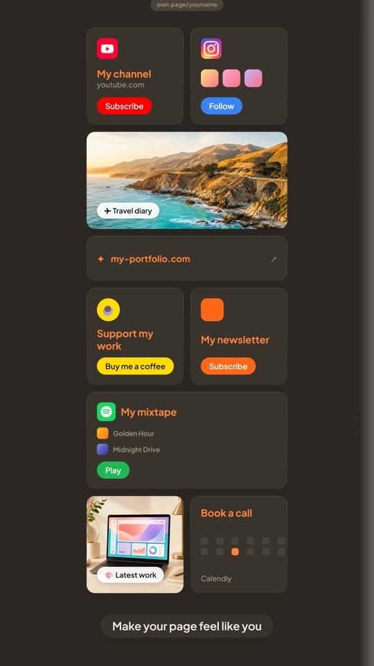
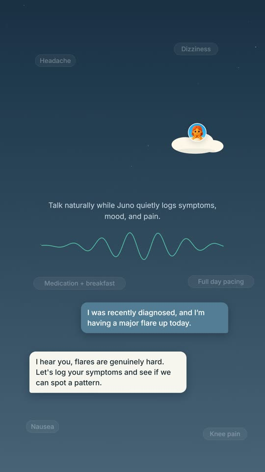
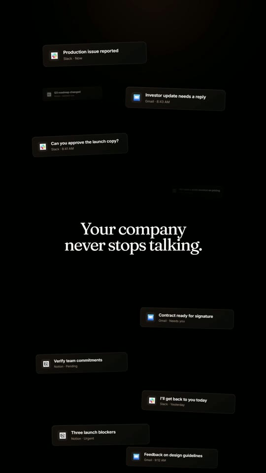

<h1 align="center">Motomation Design — Official Portfolio & Showcase</h1>

  <b>High-performance design portfolio and interactive agency showcase for Motomation Design (motomation.design).</b>

  
  
  

  
  

  
  

---

## ✨ Overview

Motomation Design is a premier creative engineering and product showcase. This repository houses the front-end codebase for the official portfolio site, featuring:

- **Interactive Project Showcase**: Clean layout highlighting mobile and web application designs.
- **Custom CSS Micro-Animations**: Smooth visual feedback and scroll-triggered animations.
- **Fully Responsive Architecture**: Mobile-first responsive layouts tailored for modern web browsers.

---

## 🎨 Tech Stack

- **HTML5**: Semantic markup with optimized SEO meta tags.
- **CSS3**: Custom CSS variables, Flexbox & Grid layouts, and custom animation keyframes.
- **JavaScript (ES6+)**: Dynamic DOM manipulation and inter-page transition handlers.

---

## 📄 License

MIT License. See `LICENSE` for details.
