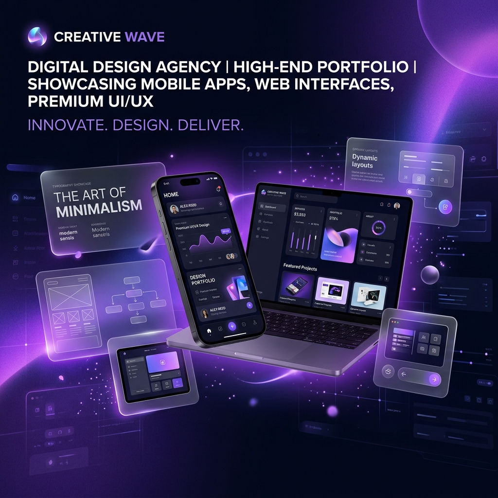

  

<h1 align="center">Motomation Design — Official Portfolio & UI Showcase</h1>

  <b>High-performance design portfolio and interactive showcase for Motomation Design (<a href="https://motomation.design">motomation.design</a>).</b>

  
  
  

---

## 🎨 Featured Client Projects Showcase

  
  

  
  

---

## ✨ Engineering & Design Specifications

- **Responsive Visual Grid**: Custom CSS Grid layout optimized across desktop, tablet, and mobile screens.
- **Video & Poster Asset Pipeline**: High-efficiency MP4 visual previews with fallback poster images.
- **Fluid Micro-Interactions**: Smooth hover states, scroll-triggered fade-ins, and keyframe transitions.

---

## 📄 License

MIT License © [Motomation Design](https://motomation.design)
